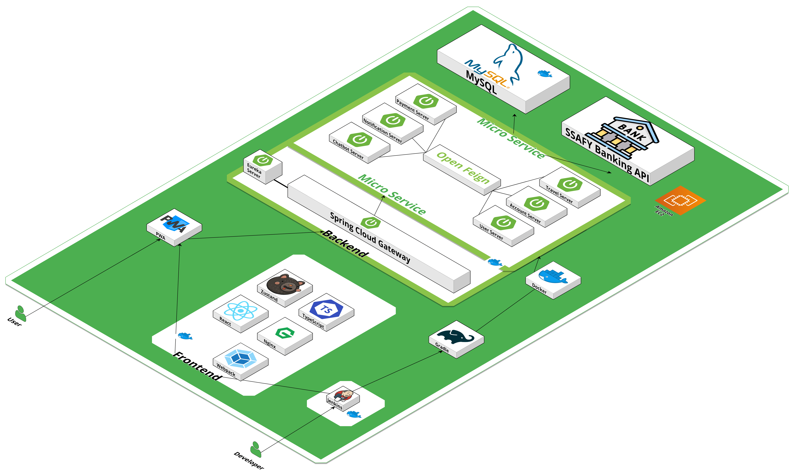
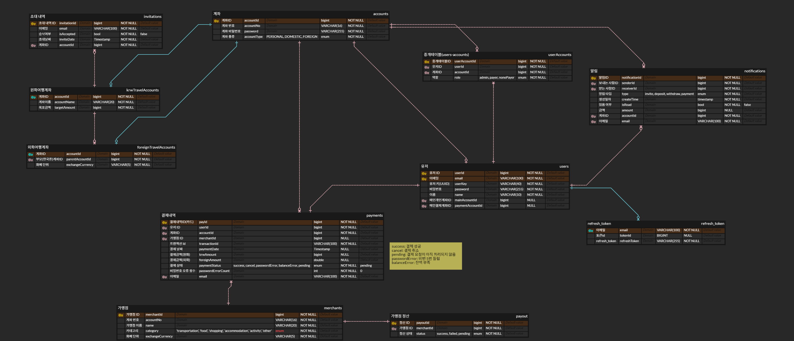

# Trabean-PJT

#  Trabean

##  프로젝트 소개

함께하는 여행을 위한 공금 관리 및 결제 솔루션

### 1. 프로젝트 목표

- 사용자가 공금 관리의 어려움을 해소하고 온전히 여행의 즐거움을 즐길 수 있도록 함

 

### 2. 주요 기능

- **공금 모으기:** 여행을 함께하는 친구들을 초대해 여행 비용을 모을 수 있는 기능
- **투명한 자금 관리:** 공금의 입출금 내역을 모든 참여자가 실시간으로 확인 가능
- **가계부:** 일 별 사용 금액 조회, 카테고리 별 사용 금액 조회
- **공금 결제 및 이체:** 여행 중 발생하는 비용을 공금에서 바로 결제
- **환전 기능:** 공금 통장을 통해 환전을 편하게 할 수 있는 기능
- **챗봇 기능:** RAG 기술을 도입하여 정확한 정보 검색 및 사용자 맞춤형 응답 제공

 

 

## 🖥 기술스택

### 1. 아키텍처

 

### 2. 기술스택

 

 
 

## 📱챗봇 시연 움짤

|                                                       |                                                         |
| ----------------------------------------------------- | ----------------------------------------------------- | ----------------------------------------------------- |
|  |  |  |
| 💰 저축                                               | 🗨 채팅                                                | 💴 환전                                               |

|                                                       |                                                         |
| ------------------------------------------------------------------ | ------------------------------------------------------------------ |
|  |  |
| 📃 여행장소 설문                                                   | 🗺 여행장소 지도                                                    |

 
 

## 🔧 ERD

 
